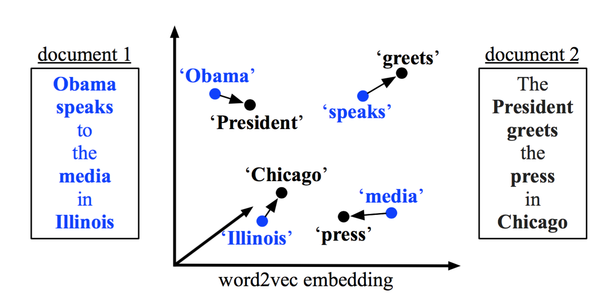
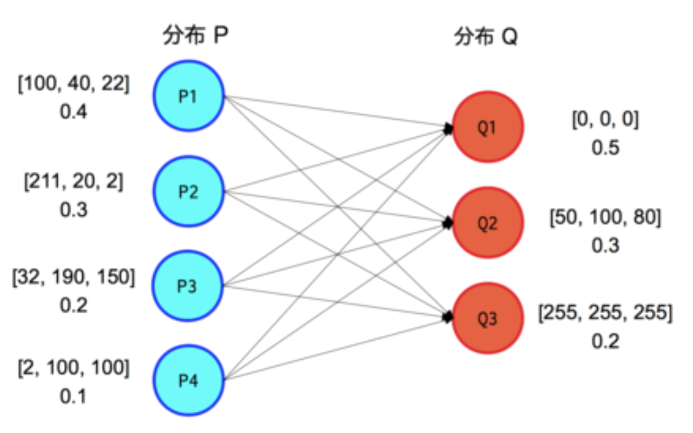

title: paper reaing 151125 
---
---
2015 ICML: From Word Embedding to Document Distances
---
一般来说，计算两个doc的相似度的方式很多。一种是先对原始的doc构建一个表达，将两个doc的相似度计算转化成两个表达的相似度计算，一个比较通用的做法是将doc表示成一个向量。构建doc表达的方式有很多种：[BOW/TF-IDF][6]、[Latent Semantic Indexing(LSI)][1]、[Latent Dirichlet Allocation(LDA)][2] 以及[PV-DBOW][3] 等等，这个也是目前比较主流的一些做法。 另一种是基于doc中meta-data的相似度来构建doc的相似度，这里的meta data可以是doc的topic[7]或者word等。这篇文章就是属于后面一种，基于word对之间的相似度来构建doc对之间的相似度。

#motivation
假设有两个doc D1和D2，我们要计算这两个句子的相似度。

* D1: obama speaks to the media in Illinois.
* D2: The President greets the press in Chicago.

很明显的，传统基于BOW/TF-IDF的相似度计算方式的话D1和D2之间的相似度是0（stop word 被移除了）.而实际上这两个句子其实是说的同一个事情，只是用了不同词而已。

#background
##word embedding
词向量这几年可以说是NLP里面最火的，有很多做词向量学习的文章，影响力比较大的就是Mikolov搞的[word2vec][4]了。直接上个图：

可以看到一个词被表示成一个向量后，在这个向量空间中，相似的词距离比较小。

##earth mover's distance(EMD)

EMD是用来计算两个分布之间的相似度的。如图中两个分布P和Q，其中分布P中每个元素Pi都有自己的capacity和feature，如图中P1的capacity为0.4，feature是向量[100,40,22]，而Q1的capacity是 0.5，feature是向量[0,0,0]。其中$P\_i$中的capacity决定能被move的量是多少，而$Q\_j$中的capacity决定能接纳的量是多少。feature向量用来计算元素之间的距离的。
$$\\min \\sum\_{i,j} f\_{i,j}* c(i,j) $$
$$s.t.  f_{i,j} >= 0 $$
$$\\sum\_i f\_{i,j} <= Q\_{j}$$
$\\sum\_j f\_{i,j} <= P\_{i}$

#Model
本文的方法其实并没有在EMD的框架上并没有什么突破性的改进，完全是原来的一套，不同只是meta data的capacity和feature不一样而已。这篇文章是将每篇文章看成文章中词的分布，每个词

#refrence
[1]: <http://www.baidu.com> "LSI"

[2]: <http://www.baidu.com> "LDA"

[3]: <http://www.baidu.com> "PV-DBOW"

[4]: <http://www.baidu.com> "word2vec"

[5]: <http://www.baidu.com> "EMD"

[6]: <http://www.baidu.com> "TF-IDF"

[7]: <http://www.baidu.com> "wanxiaojun"